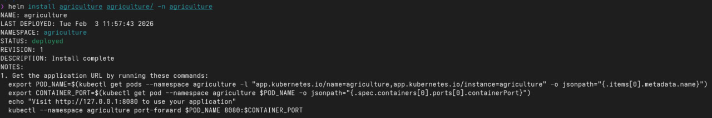
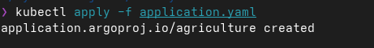
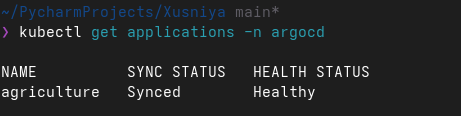
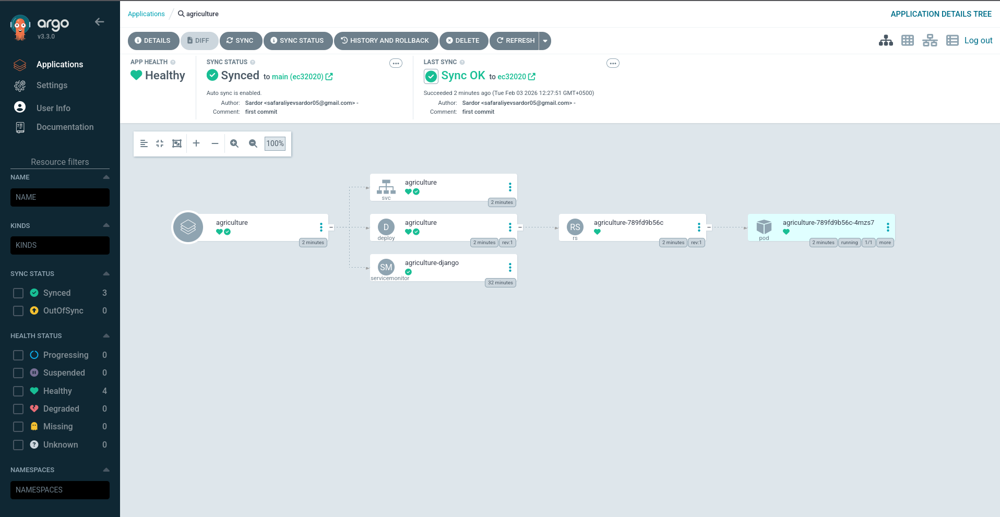
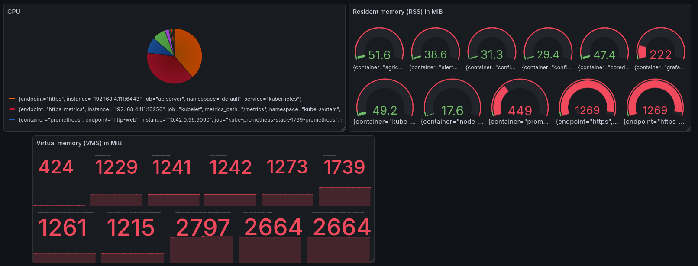
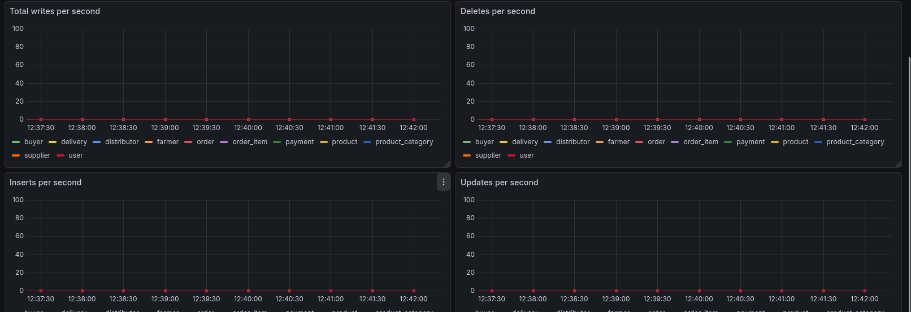
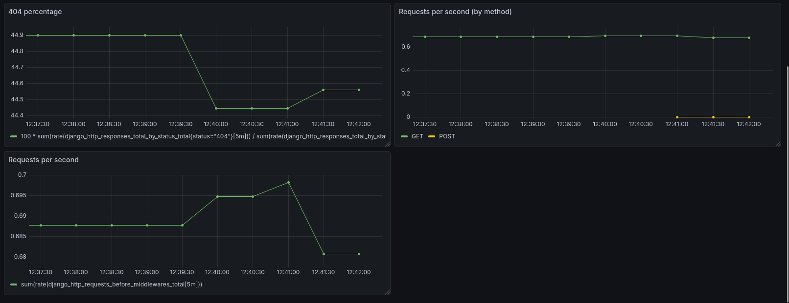
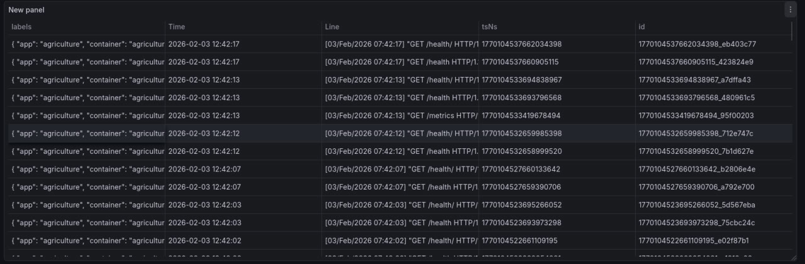

# ⚙️ Installation & Setup

1) Clone the repository

``` bash
git clone https://github.com/xusniya/argo-pro.git
```

2) Create and activate virtual environment

``` bash
python3 -m venv .venv
source .venv/bin/activate
```

3) Install dependencies

``` bash
pip install -r requirements.txt
```

4) Run the development server

``` bash
python manage.py runserver
```

# Run with Docker

Build and start containers

``` bash
docker-compose up --build
```

# Install Helm
helm install agriculture agriculture/ -n agriculture


# Argocd
Register and Checking
```bash
kubectl apply -f application.yaml
kubectl get applications -n argocd
```




# Grafana Dashboard
Custom Metrics




# Loki Logs
